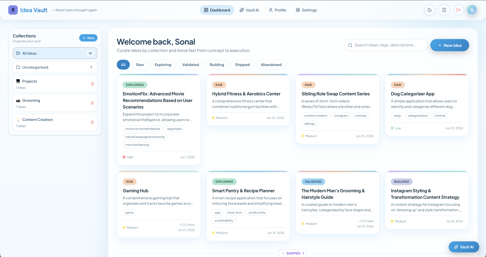
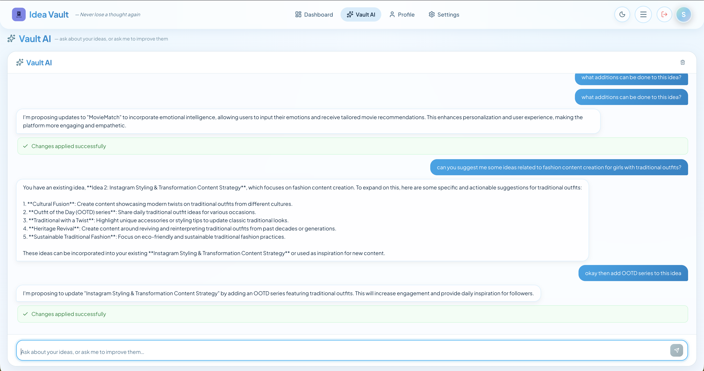
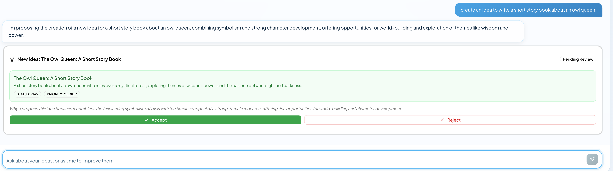
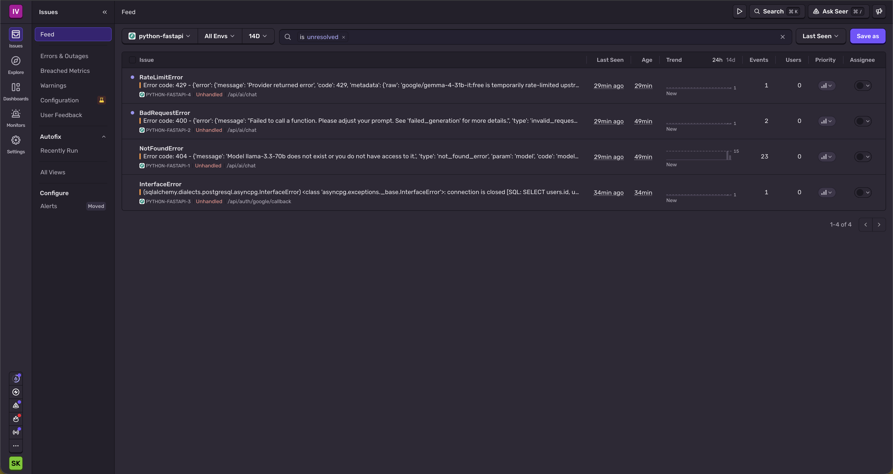
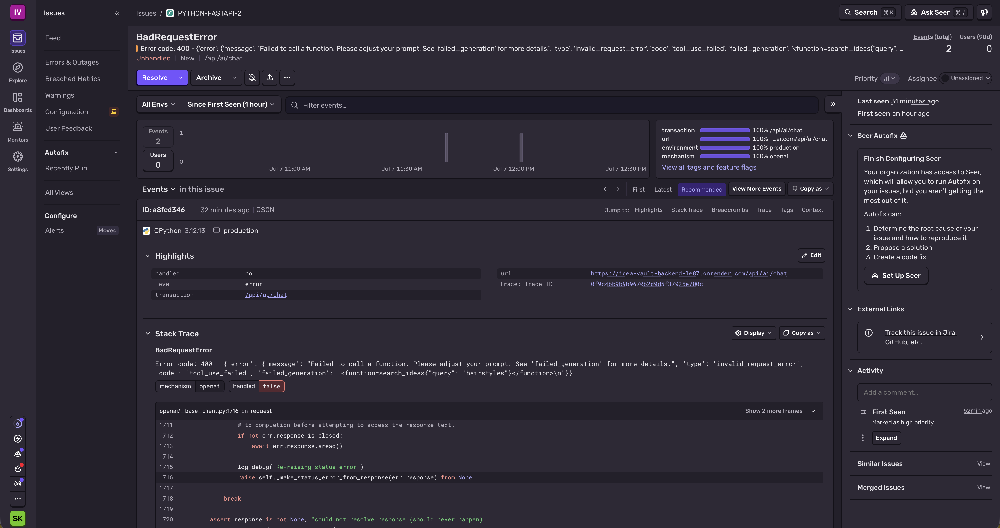
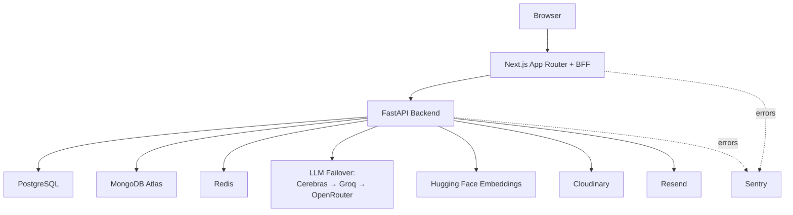
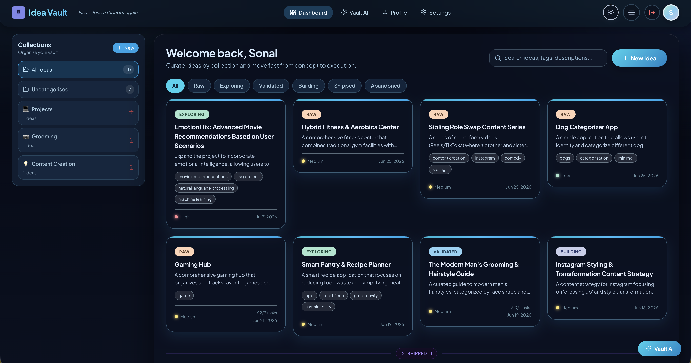
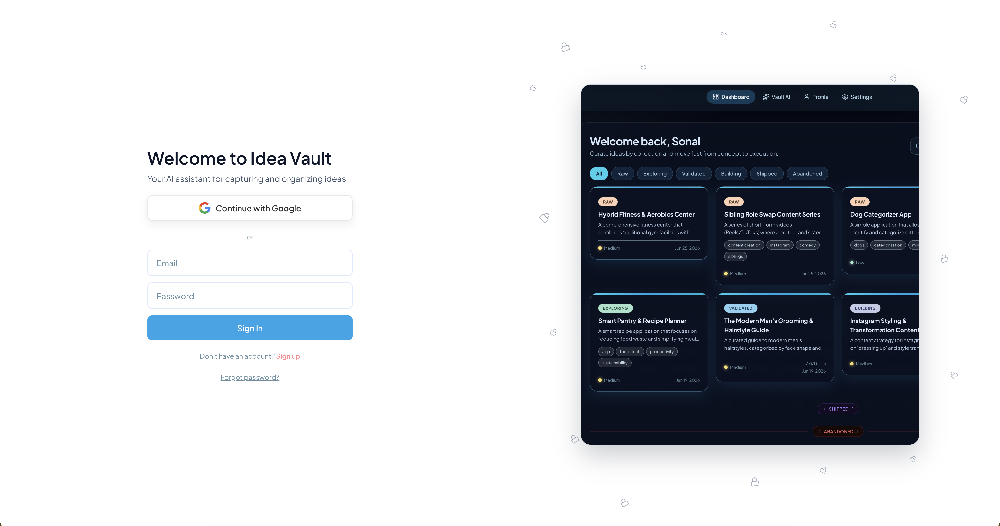
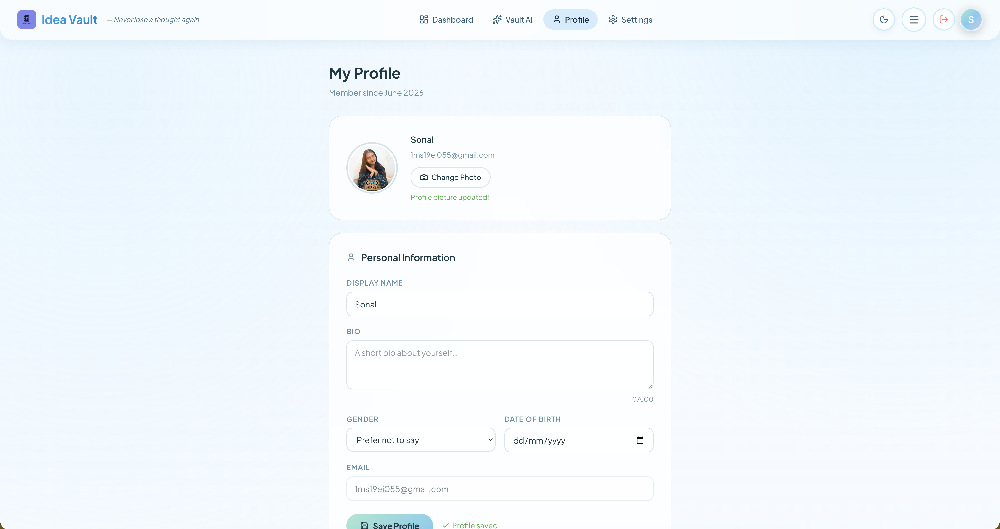

<div align="center">

# 🧠 Idea Vault

### *Never lose a thought again.*

A full-stack, production-style **AI idea-management platform** — secure auth, semantic search,
real-time AI chat, and a human-in-the-loop **AI Agent** that proposes changes before applying them.

[](https://www.idea-vault.mlguppy.site)


</div>



---

## ✨ Why This Repo Stands Out

This is **not** a CRUD demo with a chatbot bolted on. It shows real engineering judgement across
product, security, reliability, and AI systems — including trade-offs documented in postmortems.

- 🔐 **Security-first auth** — BFF proxy pattern, httpOnly refresh cookies, Google OAuth with **PKCE**, one-time code exchange
- 🧩 **Hybrid data architecture** — PostgreSQL (identity) + MongoDB Atlas (ideas + vector search) + Redis (sessions, rate limits)
- 🔎 **Semantic search** — hosted embeddings + Atlas `$vectorSearch`, with **status-aware result ranking**
- 💬 **One chat box, two brains** — a single endpoint auto-routes each message between the read (RAG) and write (Agent) pipelines
- 🤖 **Human-in-the-loop Agent** — proposes changes as reviewable diffs; nothing is written without explicit approval
- ♻️ **Rate-limit resilience** — automatic **multi-provider LLM failover** (Cerebras → Groq → OpenRouter) so free-tier limits never take the app down
- 🛡️ **Layered topic guardrails** — keeps the assistant on-topic without brittle keyword blocklists
- 🧠 **Conversation memory** — Redis sessions + sliding window + rolling summary for long chats
- 📈 **Production observability** — full-stack **Sentry** error tracking (backend + frontend) + structured logging
- 🚀 **Deployed & operated** — Docker Compose locally, Render in production, hardened from real incidents

---

## 🧭 Core Product Capabilities

### Idea management
- Create, edit, delete, and organize ideas with **status** (raw → exploring → validated → building → shipped / abandoned) and **priority**
- **Collections** — group ideas into user-scoped collections; filter by collection or "uncategorised"
- Tagging, search, and status filters
- Secure image upload via Cloudinary
- Polished **light & dark mode** throughout

### AI chat — Vault AI & Agent
- **Vault AI (RAG):** ask questions about your vault; answers stream in token-by-token
- **AI Agent:** ask it to *change* things; it returns reviewable proposals with Accept / Reject
- One chat box — the backend decides which mode each message needs

<table>
  <tr>
    <td width="50%"></td>
    <td width="50%"></td>
  </tr>
  <tr>
    <td align="center"><em>Vault AI — streaming answers grounded in your ideas</em></td>
    <td align="center"><em>AI Agent — human-in-the-loop proposal with Accept / Reject</em></td>
  </tr>
</table>

### Task execution layer
- Add, update, and remove tasks embedded under each idea
- Task progress shown in detail and summary views

### Account & identity
- Email / password auth + **Google OAuth (PKCE)**
- Password reset and email-verification flows (Resend transactional email)
- Linked auth identities — local + Google on the same account

---

## Production-Grade Engineering Highlights

### 1) BFF auth pattern (token safety by design)
- Browser never receives refresh token in JSON
- Refresh token remains in httpOnly cookies
- Next.js API routes proxy backend requests server-to-server
- Centralized retry-and-refresh wrapper for protected routes

Why this matters:
- Reduces XSS blast radius
- Keeps auth behavior consistent across all frontend routes

### 2) Human-in-the-loop Agent architecture
- Agent can search and propose, but cannot write on first call
- Backend returns structured proposals for explicit review
- Only approved proposals are executed in a separate endpoint

Why this matters:
- Safe AI interaction model for mutable user data
- Clear auditability of before/after changes

### 3) Rate-limit resilience via multi-provider LLM failover
- An ordered failover chain (**Cerebras → Groq → OpenRouter**), tried until one answers
- Independent free-tier accounts = independent rate buckets, so free capacity **stacks**
- Fails over on 429 / timeout / 5xx; streaming fails over at connect time
- Provider-agnostic tool-call parsing so the Agent works across different models

Why this matters:
- Free-tier rate limits never take the app down — the exact failure that kills most portfolio demos

### 4) Production observability (Sentry, full-stack)
- **Sentry** error tracking wired across FastAPI **and** Next.js, DSN-gated and PII-safe
- Captures unhandled crashes, all 5xx, **and** otherwise-silent LLM/provider failures
- Frontend → backend distributed traces; environment + release tagging
- Structured logging for model selection, fallback usage, and critical flows

Why this matters:
- Turns a bare production "500" into a grouped, alertable issue with a full stack trace

**Observability in action** — real backend issues captured in production. This is monitoring
*working*: each entry is a real, actionable signal rather than a silent failure.

<p align="center"><em>Issues feed — errors grouped by type, failing endpoint, and event count</em></p>



<p align="center"><em>Issue detail — full stack trace, request URL, trace ID, and environment tag</em></p>



---

## System Architecture



### Data responsibilities
- PostgreSQL: users, identity, refresh-token metadata
- MongoDB Atlas: ideas, tasks, embeddings, vector retrieval targets
- Redis: refresh/session helpers, rate limiting, transient auth exchange state

---

## Tech Stack

| Layer | Technology |
|---|---|
| Frontend | Next.js 16, React 19, TypeScript, Tailwind CSS v4 |
| Backend | FastAPI, Pydantic v2, SQLAlchemy async |
| Databases | PostgreSQL, MongoDB Atlas, Redis |
| AI | Cerebras · Groq · OpenRouter (failover) · Ollama (local), Hugging Face embeddings |
| Auth | JWT access/refresh cookies, Google OAuth PKCE |
| Infra | Docker Compose (local), Render (app), Atlas (MongoDB) |
| Observability | Sentry (errors + tracing), structured logging |
| Media/Email | Cloudinary, Resend |

---

## 🤖 AI & Agentic Capabilities

### Vault AI (RAG mode)
- **Unified endpoint** classifies each message and routes read vs write automatically
- Intent-aware routing (conversational · listing · count · semantic search · out-of-scope)
- **Model tiering** by intent (fast vs standard) to balance latency and cost
- **Status-aware ranking** surfaces active ideas over shipped/abandoned ones
- **Conversation memory** — Redis sessions, sliding window, and a rolling summary for long chats
- **Query rewriting** turns elliptical follow-ups ("what about crocodiles?") into standalone searches
- **Stop generation** — cancel mid-stream; the backend halts token generation to save quota
- SSE token streaming with live status indicators

### AI Agent (proposal mode)
- Tool-driven reasoning over strictly user-scoped data
- Structured proposal contracts: idea update, idea creation, task creation
- Before/after **diff UI** with explicit Accept / Reject
- Backend-enforced user scoping and write gating — the AI can *suggest*, never *auto-write*
- Auto re-embeds edited ideas so semantic search stays accurate

### Safety & guardrails
- **Layered topic guardrails** (regex fast-path → LLM judgment → system-prompt rules) keep it on-topic without false positives
- Refuses code-generation and general-knowledge requests with fixed, friendly messages
- Prompt-injection mitigation via input length caps and defense-in-depth

---

## Security Posture

- Refresh token not exposed to browser JS
- httpOnly cookie strategy across auth flows
- PKCE for OAuth code exchange
- User isolation enforced at query layer and write layer
- Validation via typed schemas at API boundaries
- Per-user rate limiting on AI endpoints (Redis)
- Error tracking without PII (Sentry, `send_default_pii=False`)
- Defensive client and server error handling

---

## 📸 Screenshots

| Dashboard — Light | Dashboard — Dark |
|---|---|
|  |  |

| Login | Profile |
|---|---|
|  |  |

---

## Local Development

### 1) Clone and start

```bash
git clone https://github.com/ml-guppy-lab/idea-vault.git
cd idea-vault-code
docker compose up --build
```

### 2) Configure environment variables
- Add backend and frontend env values in local env files
- Include keys for OpenRouter or Ollama, MongoDB, Redis, Cloudinary, and Resend as needed

### 3) Open app
- Frontend: http://localhost:3000
- Backend health: http://localhost:8000/health

---

## Repository Structure

```text
idea-vault-code/
├── backend/                    # FastAPI services, auth, AI, agent, data access
├── frontend/                   # Next.js app, BFF routes, UI components
├── images/                     # UI screenshots used in this README
├── Readme/                     # Versioned implementation notes (v2–v5)
└── docker-compose.yml
```

---

## Implementation Notes

Detailed build logs and architecture evolution are documented in:
- Readme/steps_v2.md
- Readme/steps_v3.md
- Readme/steps_v4.md
- Readme/steps_v5.md — collections, the unified AI endpoint, topic guardrails, conversation memory, multi-provider LLM failover, and Sentry observability

Each file is written to be read start-to-finish, with design rationale, rejected alternatives, debugging lessons, and production-hardening decisions.

---

## Roadmap Direction

- Expand agent proposal types (bulk edits, structured planning templates)
- Add automated regression coverage for critical AI decision paths
- Add analytics for agent acceptance/rejection behavior
- Introduce richer ops dashboards for latency and provider health

---

## Contributing and Release Flow

- Feature development in feature branches
- Integration in dev
- Production in main

Small, reviewable changes with rollback-aware deployment practices are preferred.
