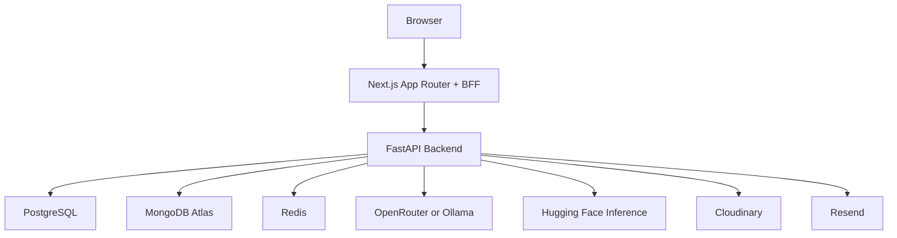

# Idea Vault

Never lose a thought again.

Idea Vault is a full-stack, production-style idea management platform with secure auth, semantic retrieval, real-time AI chat, and a human-in-the-loop Agent mode that proposes changes before applying them.

Live: [idea-vault-frontend.onrender.com](https://idea-vault-frontend.onrender.com)

---

## Why This Repo Stands Out

This is not a CRUD demo with a chatbot bolted on. It demonstrates real engineering decisions across product, security, reliability, and AI systems.

- Security-first auth architecture with BFF proxies and httpOnly cookies
- PKCE for Google OAuth and one-time token exchange flow
- Hybrid data architecture (PostgreSQL + MongoDB + Redis)
- Semantic search pipeline with hosted embeddings and Atlas vector search
- Real-time SSE chat with retries, fallback behavior, and status events
- Agentic AI with proposal contracts and explicit human approval gates
- Production hardening from real incident debugging and postmortems

---

## Core Product Capabilities

### Idea management
- Create, edit, delete, and organize ideas
- Status and priority tracking
- Tagging and filtering
- Secure image upload with Cloudinary

### AI chat modes
- Vault AI mode: read-only RAG chat for querying your idea vault
- AI Agent mode: proposal-based changes with Accept or Reject controls

### Task execution layer
- Add, update, and remove tasks embedded under each idea
- Task progress shown in detail and summary views

### Account and identity
- Email/password auth
- Google OAuth with PKCE
- Email verification and password reset
- Linked auth identities (local plus Google on same account)

---

## Production-Grade Engineering Highlights

### 1) BFF auth pattern (token safety by design)
- Browser never receives refresh token in JSON
- Refresh token remains in httpOnly cookies
- Next.js API routes proxy backend requests server-to-server
- Centralized retry-and-refresh wrapper for protected routes

Why this matters:
- Reduces XSS blast radius
- Keeps auth behavior consistent across all frontend routes

### 2) Human-in-the-loop Agent architecture
- Agent can search and propose, but cannot write on first call
- Backend returns structured proposals for explicit review
- Only approved proposals are executed in a separate endpoint

Why this matters:
- Safe AI interaction model for mutable user data
- Clear auditability of before/after changes

### 3) Reliability under model/provider constraints
- Rate-limit retries and fallback model behavior for LLM calls
- Defensive parsing for mixed provider responses
- Safe user-facing error responses with backend-side diagnostics

Why this matters:
- Graceful degradation instead of brittle failures

### 4) Observability and debugging ergonomics
- Explicit startup and service logging in critical flows
- Contextual logs for model selection and fallback usage
- Real-world error hardening reflected in implementation notes

---

## System Architecture



### Data responsibilities
- PostgreSQL: users, identity, refresh-token metadata
- MongoDB Atlas: ideas, tasks, embeddings, vector retrieval targets
- Redis: refresh/session helpers, rate limiting, transient auth exchange state

---

## Tech Stack

| Layer | Technology |
|---|---|
| Frontend | Next.js 16, React 19, TypeScript, Tailwind CSS v4 |
| Backend | FastAPI, Pydantic v2, SQLAlchemy async |
| Databases | PostgreSQL, MongoDB Atlas, Redis |
| AI | OpenRouter or Ollama, Hugging Face embeddings |
| Auth | JWT access/refresh cookies, Google OAuth PKCE |
| Infra | Docker Compose (local), Render (app), Atlas (MongoDB) |
| Media/Email | Cloudinary, Resend |

---

## AI and Agentic Capabilities

### Vault AI (RAG mode)
- Intent-aware routing (conversational, listing, count, semantic search)
- Model tiering by intent (fast vs standard)
- SSE token streaming with frontend status indicators

### AI Agent (proposal mode)
- Tool-driven reasoning over user-scoped data
- Structured proposal contracts for idea updates, idea creation, and task creation
- Diff UI (before/after) and explicit Accept or Reject decisions
- Backend-enforced user scope and write gating

---

## Security Posture

- Refresh token not exposed to browser JS
- httpOnly cookie strategy across auth flows
- PKCE for OAuth code exchange
- User isolation enforced at query layer and write layer
- Validation via typed schemas at API boundaries
- Defensive client and server error handling

---

## Screenshots

| Login | Dashboard |
|---|---|
|  |  |

| Create Idea | Idea Detail |
|---|---|
|  |  |

| Profile | Settings |
|---|---|
|  |  |

---

## Local Development

### 1) Clone and start

```bash
git clone https://github.com/ml-guppy-lab/idea-vault.git
cd idea-vault-code
docker compose up --build
```

### 2) Configure environment variables
- Add backend and frontend env values in local env files
- Include keys for OpenRouter or Ollama, MongoDB, Redis, Cloudinary, and Resend as needed

### 3) Open app
- Frontend: http://localhost:3000
- Backend health: http://localhost:8000/health

---

## Repository Structure

```text
idea-vault-code/
├── backend/                    # FastAPI services, auth, AI, agent, data access
├── frontend/                   # Next.js app, BFF routes, UI components
├── Readme/                     # Versioned implementation notes (v2, v3, v4)
└── docker-compose.yml
```

---

## Implementation Notes

Detailed build logs and architecture evolution are documented in:
- Readme/steps_v2.md
- Readme/steps_v3.md
- Readme/steps_v4.md

These files include design rationale, debugging lessons, and production hardening decisions.

---

## Roadmap Direction

- Expand agent proposal types (bulk edits, structured planning templates)
- Add automated regression coverage for critical AI decision paths
- Add analytics for agent acceptance/rejection behavior
- Introduce richer ops dashboards for latency and provider health

---

## Contributing and Release Flow

- Feature development in feature branches
- Integration in dev
- Production in main

Small, reviewable changes with rollback-aware deployment practices are preferred.
