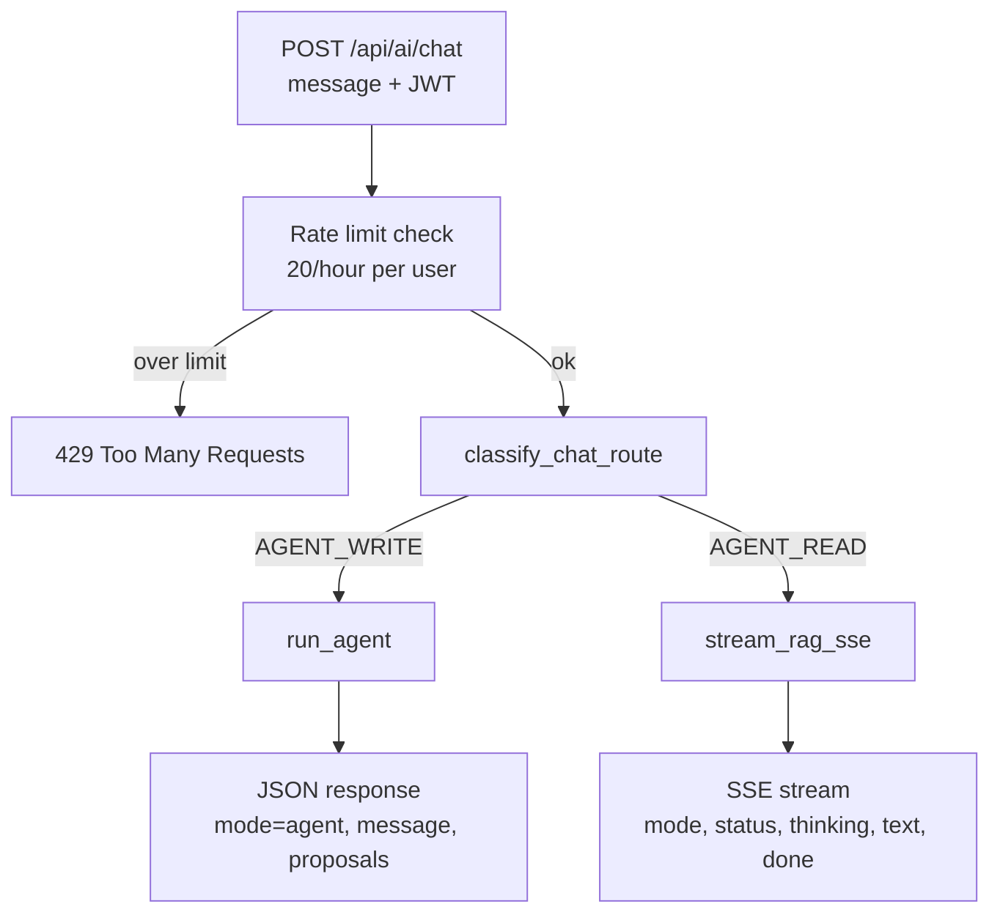
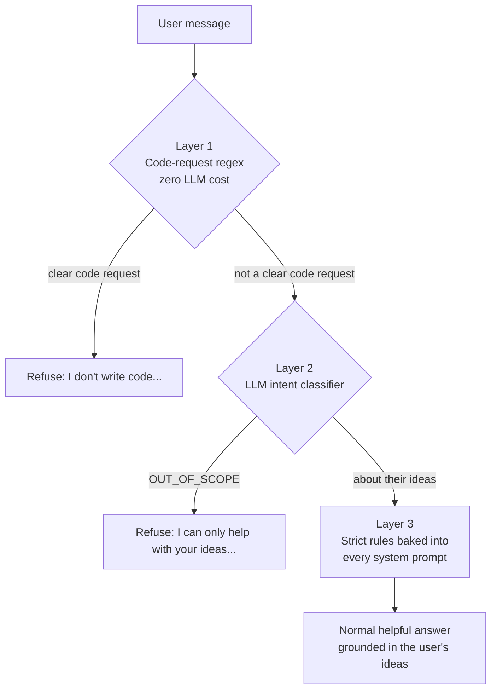

## Idea Vault — Version 5 Implementation Notes

---

## Backend Summary (Interview-Focused)

Version 5 added production-safe collection management and hardened idea image lifecycle behavior.

Most relevant backend themes:
- user-scoped authorization on every collection/image mutation
- ownership validation before writes
- safe handling of malformed legacy image data
- indexed query paths for common filters

---

## Collections: Flat Categorisation

### Why
Ideas needed a simple, user-friendly way to be grouped without introducing heavy hierarchy management.

Nested folders were intentionally avoided. Flat collections reduce query and mutation complexity while preserving practical grouping.

### Feature definition
A Collection is a named group an idea can belong to.
- One idea can belong to one collection or none (uncategorised).
- Collections are user-scoped.
- No nested collections.

### Data model
MongoDB collection: collections

Document shape:
- _id: ObjectId
- userId: string
- name: string
- emoji: string
- color: string (hex)
- createdAt: datetime
- updatedAt: datetime

Ideas were extended with:
- collectionId: Optional string (Mongo ObjectId as string), null for uncategorised

### Security model
All collection operations are authenticated and user-scoped.
- Every endpoint uses Depends(get_current_user).
- Every read/write query includes userId filtering.
- Collection IDs from URL/body are never trusted without ownership validation.

This prevents cross-user access even if someone guesses a valid ObjectId.

---

## Collections API: Full CRUD

### Canonical endpoints
- POST /api/collections
- GET /api/collections
- PUT /api/collections/{id}
- DELETE /api/collections/{id}

Additional read endpoint:
- GET /api/collections/get/{id}

### Behavior details
Create:
- Validates name, emoji, color.
- Enforces case-insensitive unique collection names per user.

List:
- Returns only current user's collections.
- Includes ideaCount per collection.

Update:
- Partial update supported (name/emoji/color optional).
- Name uniqueness check excludes current collection record.

Delete:
- Soft unlink is enforced.
- Ideas are never cascade-deleted when a collection is deleted.

Soft unlink flow:
1. Update matching ideas to collectionId = None
2. Delete the collection document

---

## Ideas API Integration: Collection Filtering

### What changed
GET ideas now supports optional collection filtering.

Route support:
- GET /api/ideas
- GET /api/ideas/list

New query parameter:
- collectionId

Filter rules:
- collectionId=<objectId> returns ideas in that collection
- collectionId=none returns uncategorised ideas only (collectionId is null)

Validation:
- Invalid ObjectId values for collectionId filter return 400

### Create and update idea integration
Idea create/update now validates collection assignment:
- collectionId must be a valid ObjectId string
- collection must belong to the current user
- invalid or foreign collectionId is rejected

Update supports explicit uncategorisation:
- collectionId null clears the assignment

---

## Ideas API Integration: Image Upload/Delete Hardening

### Endpoints
- POST /api/ideas/image
- DELETE /api/ideas/{idea_id}/image

### Security and correctness behavior
- Auth required and ownership enforced on delete (403 for non-owner).
- 404 for missing idea, 400 when no image is set.
- Cloudinary public_id extraction supports multiple URL shapes.
- Malformed/non-Cloudinary imageUrl values are handled safely:
	- database imageUrl is still cleared
	- request returns 204 (no user-visible failure)
	- structured warning/error is logged for audit/debug
- External CDN deletion is best-effort; DB state is the source of truth for UX consistency.

### Why this matters
This prevents brittle 500s from legacy/corrupt imageUrl data and keeps delete operations idempotent and production-safe.

---

## Agent Runtime Hardening (Production Bug Fix)

### Bug observed
`POST /api/agent` intermittently failed with a 500 when provider responses returned an empty or null `choices` payload.
{ The AI agent returned "Internal Server Error" because the question did not match any of the saved ideas. }

Representative failure:
- `TypeError: 'NoneType' object is not subscriptable`
- crash point: `response.choices[0]` in agent execution flow

### Root cause
The service assumed every successful completion call always contained at least one choice. Under transient provider/proxy edge cases, this assumption was invalid.

### Fix implemented
- Added defensive guards before indexing `response.choices` in both:
	- main agent completion turn
	- proposal-summary completion turn
- Added structured logging when no choices are returned.
- Added graceful fallback user message instead of raising unhandled exceptions.

### Why this matters
This converts a provider-side transient anomaly into a controlled degraded response, preserving API uptime and preventing user-facing 500s.

---

## Pydantic Schemas Added/Updated

### New file
- backend/app/schemas/collection.py
	- CollectionCreate
	- CollectionUpdate
	- CollectionResponse (with ideaCount)

### Updated file
- backend/app/schemas/idea.py
	- Added optional collectionId to IdeaCreate, IdeaUpdate, IdeaResponse, IdeaInDB
	- imageUrl remains optional and is used by image upload/delete flow

Validation highlights:
- Collection name trimmed, required, max length 50
- Color must be valid hex (example: #6366f1)

---

## Database and Indexing Updates

MongoDB connection bootstrap now creates:
- ideas index on userId
- ideas compound index on (userId, collectionId)
- collections index on userId

This keeps user-scoped lookups and collection-filtered idea queries fast and aligned with query patterns.

---

## Files Changed

- backend/app/api/collections.py
- backend/app/api/ideas.py
- backend/app/schemas/collection.py
- backend/app/schemas/idea.py
- backend/app/db/mongodb.py
- backend/app/services/image_service.py
- backend/app/services/agentic_ai/agent_service.py
- backend/app/main.py

---

## Validation and Current Status

### Completed checks
- Backend modules compile successfully after changes.
- Collections CRUD routes are wired into FastAPI.
- Soft unlink logic on delete is implemented.
- Ideas collectionId filtering is implemented.
- Image delete endpoint is resilient to malformed stored URLs and clears DB state reliably.
- Agent endpoint no longer crashes when LLM provider returns empty/null `choices`.

### Notes on Swagger verification
Implementation is complete and wired for the required flow.
Manual API acceptance checklist:
- create/list/update/delete collection
- assign and clear collectionId on idea update
- filter ideas by collectionId and by none
- upload image, delete image, verify imageUrl clears
- test delete image with malformed imageUrl value and confirm 204 + cleanup
- call `/api/agent` with normal prompts and verify graceful response even when upstream completion payload has empty/null choices

---

## Unified AI Chat Endpoint: One Door, Two Brains

> This section is written to be read start-to-finish by someone new to the codebase.
> It explains not just *what* was built, but *why* each decision was made and what
> alternatives were rejected. Take your time with it.

### The problem in plain English

Before this change, the app had **two separate AI features**, each with its own URL:

1. `POST /api/chat` — the **"read"** assistant. You ask a question about your ideas
   ("what are my fitness ideas?", "how many ideas do I have?") and it answers in
   plain text, streamed word-by-word like ChatGPT. Internally this is a **RAG**
   pipeline (explained below).
2. `POST /api/agent` — the **"write"** assistant. You ask it to *change* something
   ("improve my first idea", "add a task to my meal-prep idea") and it replies with
   **proposals** — suggested edits that you must approve before anything is saved.

The problem: **the frontend had to know in advance which one to call.** A user just
types a sentence into a chat box. They don't think "this is a read request" or "this
is a write request" — they just talk. Forcing the UI (or the user) to pick the right
endpoint is fragile and leaks backend structure into the frontend.

**The goal:** create a single endpoint, `POST /api/ai/chat`, that the frontend always
calls. The *backend* decides whether the message is a read or a write, and routes it
to the correct pipeline automatically.

### Background you need first (skip if you already know this)

**What is RAG?**
RAG = "Retrieval-Augmented Generation". Instead of letting the LLM answer from its
own memory (which knows nothing about *your* ideas), we first **retrieve** the user's
relevant ideas from the database, paste them into the prompt as context, and then ask
the LLM to **generate** an answer using that context. It's how the assistant can talk
about *your* private data without that data ever being part of the model's training.

**What is "the agent"?**
The agent is an LLM that has been given **tools** (functions it can call), like
`propose_idea_update` or `propose_task_creation`. When you ask it to change something,
it doesn't edit the database directly — it produces a **proposal** object describing
the change. A human approves or rejects it later. This "human-in-the-loop" design is a
safety feature: the AI can *suggest* writes, but never *performs* them on its own.

**What is SSE (Server-Sent Events)?**
A normal HTTP response sends the whole body at once. SSE keeps the connection open and
streams many small messages over time, each line starting with `data: `. We use it so
the read assistant can show its answer appearing token-by-token instead of making the
user stare at a spinner until the full answer is ready.

**What is "intent classification"?**
Asking a small, fast LLM to read a sentence and output a single label describing what
the user *wants* (e.g. `COUNT`, `LISTING`). It's a cheap way to make routing decisions.

### The core idea: classify first, then route

The new endpoint does three things in order:

1. **Rate-limit** the user (reject abusive volumes before spending any money on LLM calls).
2. **Classify** the message into one of two buckets: `AGENT_WRITE` or `AGENT_READ`.
3. **Route**:
   - `AGENT_WRITE` → run the agent → return **JSON** with proposals.
   - `AGENT_READ` → run the RAG pipeline → return an **SSE stream** of text.



### Decision 1 — A separate "routing brain", NOT an extension of the existing one

The existing read pipeline already has an intent classifier with an enum called
`QueryIntent` (`CONVERSATIONAL`, `LISTING`, `SEMANTIC_SEARCH`, `COUNT`). The obvious
shortcut would be: "just add two more values, `AGENT_WRITE` and `AGENT_READ`, to that
same enum."

**We deliberately did NOT do that.** Here's why:

`QueryIntent` is consumed by other functions deep inside the RAG pipeline —
`route_query` (decides which database lookup to run) and `select_tier_for_intent`
(decides which LLM model size to use). Those functions have a hard assumption: *every*
`QueryIntent` value is a kind of read. If we added `AGENT_WRITE` to that enum, every
one of those functions would suddenly receive a value it has no idea how to handle. We'd
have to hunt down and patch each one, and we'd risk subtle bugs where a write intent
accidentally flows into read-only retrieval code.

So instead we created a **brand-new, separate enum** called `ChatRoute` with exactly two
values (`AGENT_WRITE`, `AGENT_READ`) and a separate function `classify_chat_route()`.
This is a coarser, higher-level decision that sits *above* the existing one:

- `classify_chat_route()` decides **which pipeline** (agent vs RAG).
- The old `classify_intent()` still runs *inside* the RAG pipeline to decide **how to
  read** (count vs list vs search).

This is a general principle worth remembering: **when a new concept doesn't fit the
assumptions of an existing type, make a new type rather than overloading the old one.**
Overloading saves three lines today and costs you a week of debugging later.

### Decision 2 — Regex fast-path first, LLM second (a hybrid classifier)

How does `classify_chat_route()` actually decide write vs read? There were three options:

- **Option A: pure keyword/regex matching.** Fast and free, but brittle. The sentence
  "I have ideas about *improving* my sleep" contains the word "improve" but is clearly a
  *read*, not a command to edit anything. Pure keywords produce false positives.
- **Option B: pure LLM classification.** Accurate, but every single message — including
  trivial ones like "improve my first idea" — costs an LLM call and adds latency.
- **Option C (chosen): a hybrid.** First run a *very conservative* regex that only
  matches obvious, unambiguous write commands. If it matches, we're done instantly — no
  LLM call. If it doesn't match, fall back to a small/fast LLM that makes the final call.

The regex (`_WRITE_FASTPATH`) is intentionally **high-precision, low-recall**: it would
rather miss a real write (and let the LLM catch it) than wrongly flag a read. That's why
it requires the action verb to sit *next to* a reference to the user's content. For
example it matches "improve **my idea**" or "rewrite **the description**", but it will
**not** match "ideas about improving sleep", because "improve" there isn't followed by
words like *idea / task / description / it / my*.

Anything the regex isn't sure about goes to the LLM, which is given a focused prompt with
worked examples and must answer with just `AGENT_WRITE` or `AGENT_READ`.

**The safety net:** if the LLM is rate-limited, returns nothing, or returns garbage, we
default to `AGENT_READ`. Why read and not write? Because the read path is non-destructive
— the worst case is the user gets an answer instead of a proposal, which is mildly
annoying. Defaulting to *write* could surface confusing, unwanted edit suggestions.
**When in doubt, pick the safer behavior.**

### Decision 3 — Two different response *shapes*, on purpose

This endpoint is unusual: it can return **two completely different types of HTTP response**
depending on the route.

- **Write** → a normal JSON object:
  `{"mode": "agent", "message": "...", "proposals": [ ... ]}`
- **Read** → an SSE stream (`Content-Type: text/event-stream`).

Why not force both into the same shape? Because they have genuinely different needs. A set
of proposals is a *finished, structured object* — the UI needs all of it at once to render
review cards with Accept/Reject buttons. A conversational answer is *a flow of text* that
feels best when streamed live. Forcing proposals into a stream, or buffering the chat answer
into one big JSON blob, would make both worse.

So the frontend tells the two apart by looking at the response's `Content-Type` header:
`application/json` means "agent proposals", `text/event-stream` means "live chat".

To make the streaming case even easier for the client, the **very first SSE event** we send
is `{"type": "mode", "content": "rag"}`. This way the frontend instantly knows "this is a
read stream" without waiting or guessing.

One small but important detail: proposals contain enum values (like idea status/priority).
Python's default JSON serializer can't handle enums, so we serialize with
`model_dump(mode="json")`, which converts enums into plain strings. (This is the kind of bug
that only shows up at runtime, so it's worth knowing.)

### Decision 4 — Share code, don't copy-paste

Both the old `/api/chat` and the new `/api/ai/chat` need the *exact same* read behavior
(rate limiting + the RAG streaming logic). Copy-pasting that logic into two files would mean
every future bug fix has to be made twice — and someone will eventually forget. So we pulled
the shared pieces into their own small modules:

- `app/core/rate_limit.py` → `check_message_rate_limit()`. Both endpoints call this. Because
  they share the **same Redis key** (`chat_rl:{user_id}`), a user can't dodge the limit by
  hopping between endpoints — all their AI usage counts against one budget.
- `app/ai/chat_pipeline.py` → `stream_rag_sse()` and `format_sse()`. This is now the single
  source of truth for "decompose the question → fetch the user's ideas → stream the answer as
  SSE". The old `/api/chat` was refactored to call this instead of holding its own copy.

This is the **DRY principle** ("Don't Repeat Yourself"): one behavior should live in exactly
one place.

### Decision 5 — Keep the old endpoints, but mark them deprecated

We did **not** delete `/api/chat` and `/api/agent`. Anything still calling them (the current
frontend, saved bookmarks, tests) would break instantly if we removed them. Instead we marked
them with `deprecated=True`, which:

- keeps them fully working, and
- visibly flags them as "old" in the auto-generated API docs (Swagger),

so we can migrate the frontend calmly and delete them in a later cleanup pass. This is the
standard, professional way to retire an API: **deprecate first, remove later.** Note that
`/api/agent/decide` (the Accept/Reject approval step) is **not** deprecated — the unified
endpoint only replaces the *propose* and *ask* steps, not the approval step.

### Security guarantees (these were preserved, not invented)

The new endpoint follows the same rules every protected route in this app follows:

- **`user_id` always comes from the verified JWT, never from the request body.** A user
  physically cannot ask about or edit someone else's ideas, because the identity is taken from
  their signed token, not from anything they typed.
- **Input is length-capped** at the HTTP boundary (`ChatRequest`, max 500 chars) and *again*
  inside the classifier (truncated to 200 chars). This is "defence in depth" — limiting the
  blast radius of any prompt-injection attempt.
- **Rate limiting runs before any LLM call**, so abusive traffic is rejected for free.

### The request/response contract (what the frontend must handle)

Request (identical for both routes):
```
POST /api/ai/chat
Authorization: Bearer <jwt>
Body: { "message": "..." }   // 1–500 characters
```

Response — write route:
```
Content-Type: application/json
{ "mode": "agent", "message": "Here are my suggestions", "proposals": [ {...}, {...} ] }
```

Response — read route:
```
Content-Type: text/event-stream
data: {"type": "mode",     "content": "rag"}
data: {"type": "status",   "content": "Searching your ideas..."}
data: {"type": "thinking", "content": "..."}
data: {"type": "text",     "content": "Your"}
data: {"type": "text",     "content": " ideas"}
data: {"type": "done",     "content": ""}
```

### Files changed

New files:
- `backend/app/api/ai.py` — the unified `POST /api/ai/chat` endpoint.
- `backend/app/ai/chat_pipeline.py` — shared RAG-to-SSE streaming helper (`stream_rag_sse`, `format_sse`).
- `backend/app/core/rate_limit.py` — shared per-user rate limiter (`check_message_rate_limit`).

Updated files:
- `backend/app/services/intent_classifier.py` — added `ChatRoute` enum, `_WRITE_FASTPATH` regex, and `classify_chat_route()`.
- `backend/app/api/chat.py` — refactored to use the shared helpers; marked `deprecated=True`.
- `backend/app/api/agent.py` — propose endpoint marked `deprecated=True` (approval endpoint untouched).
- `backend/app/main.py` — registered the new `ai` router under `/api`.

### How to verify it works

1. Send `POST /api/ai/chat` with `{"message": "what are my ideas?"}` →
   expect `Content-Type: text/event-stream`, a leading `mode: rag` event, then streamed text.
2. Send `POST /api/ai/chat` with `{"message": "improve my first idea"}` →
   expect `Content-Type: application/json` with `"mode": "agent"` and a `proposals` array.
3. Send 21 messages within an hour → the 21st should return `429`.
4. Confirm the old `/api/chat` and `/api/agent` still respond but appear struck-through /
   marked deprecated in Swagger.

---

## Topic Guardrails: Keeping the Assistant On-Topic

> Like the section above, this is written to be read start-to-finish by a beginner.
> It explains the problem, every option we considered, why we rejected the tempting-but-
> dangerous one, and exactly what we built. Go slowly — the *reasoning* matters more than
> the code.

### The problem in plain English

Idea Vault's assistant is meant to talk about **one thing only: your own saved ideas and
tasks.** But because it is powered by a general-purpose LLM, it was happy to do things it
was never meant to do:

1. **Answer general-knowledge questions** — "what is the capital of France?", "explain
   quantum physics", "who won the World Cup in 2018?". The model just knows these, so it
   answered them. That makes the product feel like a generic ChatGPT clone instead of a
   focused idea companion.
2. **Write code** — "give me Python code to reverse a number". Again, the model can do
   this, so it did. But Idea Vault is not a coding tool.

We wanted two specific behaviors instead:

- Off-topic question → politely refuse with one fixed sentence:
  *"I can only help you with your saved ideas and tasks in Idea Vault."*
- "Write me code" request → politely refuse with a different fixed sentence:
  *"I don't write code. I can help you think through the idea behind it though."*

### The trap: the "obvious" solution is the wrong one

The tempting fix is a **keyword blocklist**: keep a list of banned words/phrases like
`"write a"`, `"javascript"`, `"who is"`, `"history of"`, `"python code"`, and if the user's
message contains any of them, refuse.

This is fast, free, and **dangerously wrong**. A blocklist looks only at the *letters* in
the sentence, not its *meaning*. Watch how each banned phrase destroys a perfectly valid,
on-topic request:

| Banned phrase | Innocent message it would wrongly block |
|---|---|
| `"javascript"` | "I have an idea for a **JavaScript** learning app" |
| `"who is"` | "**Who is** my target audience for this idea?" |
| `"history of"` | "What's the **history of** my fitness idea?" |
| `"write a"` | "Help me **write a** better description for my idea" |

Every one of those is exactly the kind of thing the assistant *should* help with — and the
blocklist would slam the door on all of them. This is called a **false positive**: blocking
something that should have been allowed. For a feature whose whole job is to be helpful about
ideas, false positives are the worst possible failure. **A guardrail that blocks real work is
worse than no guardrail at all.**

So the guiding rule for this whole feature became: **be strict about refusing off-topic and
code requests, but never at the cost of blocking a genuine idea conversation.**

### The solution: three layers, each catching what the others miss

Rather than one crude filter, we built **three layers of defense**. Each layer is good at a
different thing, and they back each other up. Think of it like airport security: a quick metal
detector for the obvious stuff, a trained officer for judgment calls, and clear posted rules as
the final backstop.



Let's walk through each layer and *why* it exists.

### Layer 1 — A tiny, ultra-precise code detector (costs nothing)

**What it is:** a single regular expression (a text-pattern matcher) that runs *before any AI
call at all*. If it fires, we instantly return the code refusal and stop. No LLM, no latency,
no cost. This lives in `is_code_generation_request()` in `intent_classifier.py`.

**Why have it at all, if Layer 2 already catches off-topic stuff?** Two reasons:

1. **Speed and cost.** "Give me Python code to reverse a number" is *obviously* a code
   request. Spending an LLM call to figure that out is wasteful. A regex answers in
   microseconds for free.
2. **A hard guarantee.** Because this runs first and doesn't depend on a model behaving well,
   it is a deterministic promise: the clearest code requests are *always* refused, even if the
   AI were having a bad day.

**The critical design choice: high precision, low recall.** Remember the false-positive trap.
We deliberately made this regex *picky* — it would rather **miss** a code request (and let
Layer 2 catch it) than **wrongly flag** an idea conversation. It only fires when the message is
unmistakably asking the assistant to *produce code*. Concretely, it triggers on things like:

- a "make" verb sitting right next to the word **code** — "write code", "give me python **code**"
- a programming language glued to a code word — "python **script**", "bash **code**"
- "**code** to / that / for ..." — "**code** to reverse a string"
- inherently-code words — "**one-liner**", "**pseudocode**"
- "debug / refactor **my code**"

And — just as important — it is built to **stay silent** on things that merely *sound*
technical but are really idea talk:

- "do I have any **coding** ideas?" → allowed
- "what should I **build** for my app idea?" → allowed
- "I have an idea for a **JavaScript** learning app" → allowed
- "I want a **script** for a short film idea" → allowed (a film script, not code!)

We verified this with a test of 31 sentences: **all 15 real code requests were caught, and all
16 innocent idea messages were let through.** Zero false positives.

> **One sharp edge worth remembering** (this is the kind of bug that wastes an afternoon): the
> regex is written in "verbose mode", where a `#` character normally starts a comment. The
> language `c#` therefore had to be escaped as `c\#`, otherwise Python silently treats the rest
> of the line as a comment and the pattern fails to build. Tools like `compileall` won't catch
> this because the regex is only *built* when the code actually runs.

### Layer 2 — Let a small AI use *judgment*, not keywords

Layer 1 only handles code. What about "what is the capital of France?" That's not code, so
Layer 1 ignores it — and we still need to refuse it.

Here's the key insight: **the problem with the keyword blocklist was never that it used a
computer to decide — it was that keywords can't understand meaning.** So for the harder
"is this even about their ideas?" question, we use the thing that *can* understand meaning: an
LLM, used as a **classifier**.

The app already had a small, fast classifier (`classify_intent`) that sorts read questions into
buckets — `CONVERSATIONAL`, `LISTING`, `SEMANTIC_SEARCH`, `COUNT`. We added one more bucket:
**`OUT_OF_SCOPE`**. Now the classifier's job includes deciding "is this message about the
user's own ideas, or is it something from the outside world?"

Because it judges *meaning*, it can make the distinction a blocklist never could:

- "do I have any **coding** ideas?" → `SEMANTIC_SEARCH` (about their ideas — answer it)
- "what's the **history of** my fitness idea?" → `SEMANTIC_SEARCH` (about their idea — answer it)
- "what is the **capital of France**?" → `OUT_OF_SCOPE` (outside world — refuse)
- "explain **quantum physics**" → `OUT_OF_SCOPE` (outside world — refuse)

We also fixed a subtle hole we found along the way. The old classifier description for
`CONVERSATIONAL` literally said *"general questions not about ideas"* — which was quietly giving
the assistant permission to answer trivia as "small talk". We tightened it: `CONVERSATIONAL` now
means **only** greetings and chit-chat aimed at the assistant ("hi", "thanks", "what can you
do?"). Anything from the outside world goes to `OUT_OF_SCOPE`.

**What happens when a message is `OUT_OF_SCOPE`?** The pipeline short-circuits: it immediately
sends the fixed scope refusal and **skips the expensive answer-generation step entirely.** This
is the "intercept at the classifier level" behavior — we don't waste a big LLM call generating
an answer we're just going to throw away. The off-topic message is stopped at the cheap front
gate, not the expensive back room.

> **A nice property for mixed messages:** if someone asks two things at once — "hi, and what's
> the capital of France?" — the idea-related part always wins the routing, so we never
> accidentally refuse a message that contains *some* legitimate request. Pure off-topic messages
> are the only ones that get refused.

### Layer 3 — Write the rules into the assistant's "job description"

Layers 1 and 2 are gatekeepers that run *before* the main assistant. Layer 3 is different: it's a
set of **hard rules baked into the system prompt** — the hidden instructions the LLM reads before
every single answer. Think of it as the assistant's employment contract.

We created one shared rules block (`STRICT_GUARDRAILS`) and injected it into **every** generation
prompt — the read assistant (RAG) *and* the write assistant (the agent). In plain language, the
rules say:

1. Only ever discuss the user's own saved ideas and tasks.
2. Never write, complete, or debug code — in any language — even if asked directly.
3. Never answer general-knowledge questions.
4. Discussing the *concept* behind a coding idea is fine; writing the actual code is not.
5. If a request is off-topic, reply with exactly the scope-refusal sentence.
6. If a request is to write code, reply with exactly the code-refusal sentence.

**Why do we need this if Layers 1 and 2 already exist?** Because no gatekeeper is perfect. A
cleverly-worded request might slip past the regex and get mislabeled by the classifier. Layer 3 is
the **last line of defense**: even if a bad request reaches the main assistant, the assistant's own
instructions tell it to refuse. Defense in depth means *every* layer would have to fail at once for
a bad answer to get through — which is far less likely than any single layer failing.

Notice rule 4 — it captures the most important nuance of the whole feature: **talking about a
coding idea is encouraged; writing the code is forbidden.** "What should I build for my app idea?"
gets a thoughtful, helpful answer. "Write the app's login function" gets refused. Same topic,
different action.

### Why three layers instead of just one?

Each layer covers a different weakness of the others:

| Layer | Strength | Weakness (covered by...) |
|---|---|---|
| 1. Regex | Instant, free, guaranteed for obvious code | Only knows code, not meaning → Layer 2 |
| 2. LLM classifier | Understands meaning, catches all off-topic | Costs a small call; can occasionally misjudge → Layer 3 |
| 3. System-prompt rules | Always present, final backstop | Relies on the big model obeying → Layers 1 & 2 catch most first |

Crucially, **none of the three layers is the keyword blocklist we rejected.** The cheap layer
(regex) is deliberately narrow enough to never block idea talk, and the broad decisions are made by
*meaning-aware* AI judgment. That is the whole point: we got strictness **without** the false
positives.

### The two refusal messages (kept identical everywhere)

There are exactly two fixed responses, defined once as constants and reused by all three layers so
the wording can never drift apart:

- **Off-topic:** "I can only help you with your saved ideas and tasks in Idea Vault."
- **Code request:** "I don't write code. I can help you think through the idea behind it though."

Refusals are delivered to the browser as a normal streamed assistant message, so to the user they
look just like any other reply in the chat — no scary error popups, no broken UI.

### Files changed

Updated files:
- `backend/app/services/intent_classifier.py` — added the two refusal constants
  (`SCOPE_REFUSAL`, `CODE_REFUSAL`), the shared `STRICT_GUARDRAILS` rules block, the high-precision
  `is_code_generation_request()` detector, and the new `OUT_OF_SCOPE` value on `QueryIntent` (with
  a rewritten classifier prompt).
- `backend/app/ai/query_router.py` — added an `OUT_OF_SCOPE` route that returns an empty context
  with no database lookup.
- `backend/app/ai/chat_pipeline.py` — short-circuits `OUT_OF_SCOPE` to the fixed scope refusal
  (skipping answer generation) and added a small `refusal_stream()` helper.
- `backend/app/api/ai.py` — runs the zero-cost code detector at the very top of the endpoint,
  before any LLM call.
- `backend/app/services/rag_service.py` — injected `STRICT_GUARDRAILS` into every read-assistant
  system prompt and added a defensive `OUT_OF_SCOPE` prompt branch.
- `backend/app/services/agentic_ai/agent_service.py` — appended `STRICT_GUARDRAILS` to the write
  agent's system prompt.

### How to verify it works

1. Send "give me a python code to reverse a number" → expect the **code refusal**, returned
   instantly with **no LLM call** (Layer 1).
2. Send "do I have any coding ideas?" → expect a **normal, helpful answer** about your ideas
   (not blocked).
3. Send "what should I build for my coding idea?" → expect the assistant to **discuss the idea**
   without writing any code.
4. Send "what is the capital of France?" → expect the **scope refusal**, with the answer-generation
   step **skipped** at the classifier level (Layer 2).
5. Try several off-topic questions (trivia, math, science, definitions) → all should be refused
   with the same scope-refusal sentence.

---

## Re-Summarising and Re-Embedding Edited Ideas

### The bug
Semantic search in Idea Vault ranks ideas by an **embedding** (a numeric "meaning" vector)
built from **only the `title` + `summary`** — not the description, tags, or status.

When the agent edited an idea's title/description, it left the `summary` unchanged. So after a
meaningful edit the embedding became a stale mix (new title, old summary), and searching for the
idea's *new* concept could fail to find it. No error, just silently wrong search results.

### The fix
When an edit genuinely changes an idea's meaning, the agent also proposes a new summary, and
accepting it rebuilds the embedding from the new title + new summary.

Two guards keep this safe:
- **Only on real meaning changes.** `new_summary` is optional and judgment-based — the agent's
  prompt and the tool description tell it to propose one only when a title/description change
  alters the concept, and to omit it for typos/wording tweaks (2–3 sentences, max ~190 words).
- **Only re-embed when needed, in the background.** Embedding is CPU-heavy, so we reuse the
  existing `_embed_and_store` background-task pattern: save the change immediately, then re-embed
  *after* responding — and only if the title or summary actually changed (compared against the
  stored values). Edits that touch only status/priority skip it entirely.

### Decisions
- Matched the real helper signature `_embed_and_store(db, idea_id, title, summary)` (the spec
  had it wrong).
- Re-embed on genuine change only, not on every accept (mirrors the normal edit endpoint).
- Used a local import of `_embed_and_store` inside `execute_proposal` to avoid a circular import
  (the ideas API already depends on services).
- Left the idea-*creation* path alone — it already summarised and embedded correctly.

### Files changed
- `backend/app/schemas/agent.py` — optional `current_summary` / `new_summary` on the update proposal.
- `backend/app/services/agentic_ai/agent_tools.py` — `current_summary` / `new_summary` added to the
  `propose_idea_update` tool.
- `backend/app/services/agentic_ai/agent_service.py` — prompt guidance on when to propose a summary;
  `execute_proposal` saves it and schedules a background re-embed (gained a `BackgroundTasks` param).
- `backend/app/api/agent.py` — `/agent/decide` passes `BackgroundTasks` through to `execute_proposal`.
- `frontend/components/agent/ProposalCard.tsx` — summary fields on the type plus a "Summary" `DiffView`
  shown when a new summary is proposed.

### How to verify it works
1. Ask the agent to significantly rewrite an idea → the proposal card shows a **Summary** diff.
2. Ask for a tiny wording fix → no summary diff appears.
3. Accept a meaning-changing update → response returns immediately; embedding refreshes in the background.
4. Search for the idea by its new concept → it is found, proving the embedding caught up.
5. Accept a status/priority-only change → no re-embedding is triggered.

---

## Conversation History: Redis Sessions, Context Window, and Query Rewriting

### The problem
Each chat message was handled in isolation — the assistant had no memory of the conversation.
A follow-up like *"which of these relate to weight loss?"* was meaningless: there was no "these",
and embedding such a sentence for semantic search produces a noise vector that finds nothing.

### The fix
Three pieces working together:
- **Server-side sessions (Redis).** Every conversation gets a unique `session_id`. Messages are
  stored under `chat_session:{user_id}:{session_id}` and loaded on each new message so the model
  sees prior turns. Redis is used (not MongoDB) for microsecond reads/writes and a built-in **TTL**
  that auto-expires idle sessions after **3 hours** — no cleanup job, no stale data.
- **Context-window management (sliding window).** LLMs have a finite context, so we feed only the
  **last 10 messages** to the model and cap what we keep in Redis (40 messages). Recent turns are
  enough for continuity without blowing the token budget. (A rolling LLM summary of older turns
  could be layered on later.)
- **Query rewriting.** Before retrieval, a fast LLM call uses the history to rewrite a follow-up
  into a **standalone search query** (*"which of these relate to weight loss?"* →
  *"ideas about weight loss and diet"*). The rewritten query is used **only for retrieval**; the
  original message is still what the answer model sees, so replies stay natural. Whenever history
  exists we always run the reformulation (the model returns the message unchanged if it is already
  self-contained) — this also feeds the intent classifier a context-grounded query, so elliptical
  follow-ups like *"what about crocodiles?"* are no longer misread as off-topic.

### Decisions
- **Security: user_id always from the JWT** when building the Redis key — never from the request
  body. A forged/guessed `session_id` can only ever reach the caller's own history.
- **Pass `redis` as a parameter** (matching `rate_limit.py` / dependency injection) rather than
  importing a module global — consistent and testable.
- **Persist only clean exchanges.** The user message + full assistant reply are saved *after*
  streaming completes; errors are never written, so a failed turn can be retried cleanly.
- **session_id delivery differs by path.** The agent (write) path returns it in the JSON body; the
  RAG (read) path can't, so it emits a leading `{"type":"session", ...}` SSE event the client reads.
- **Rewrite whenever there is history (no keyword gate).** An earlier version skipped rewriting
  unless the message contained a referential word ("these", "it", "that one"). That broke
  *elliptical* follow-ups like *"what about crocodiles?"* — no pronoun, but fully context-dependent:
  the bare query reached the off-topic guardrail and got a canned refusal. The fix follows the
  standard history-aware-retriever pattern: always reformulate when history exists and let the LLM
  no-op truly standalone messages. A separate "only if intent is semantic" gate was also **not**
  added — intent is classified downstream, so gating on it would cost an extra LLM call, and the
  reformulation already grounds the query so the classifier routes it correctly.
- **History threads into both brains.** Recent turns are inserted between the system prompt and the
  new message for both the RAG answer and the agent loop, so follow-ups like *"now improve it"* work.
- **Reuse the existing "Clear chat" button as the session reset — no separate "New Chat".** A
  dedicated "New Chat" control implies past conversations are saved and switchable, which would
  invite a chat-history list (explicitly out of scope for this project). One delete button keeps the
  mental model unambiguous: there is one live conversation — clear it to start a fresh session
  (resets `session_id` to null and wipes the thread).
- **Backward compatible.** New params are all optional/keyword — the legacy `/api/chat` and
  `/api/agent` callers are unchanged and store nothing.

### Files changed
- `backend/app/services/session_service.py` *(new)* — Redis session storage: `generate_session_id`,
  `get_session_history`, `save_exchange`, `clear_session`, `history_window`; TTL + window constants.
- `backend/app/ai/query_rewriter.py` *(new)* — `rewrite_query(history, message)` using the fast
  classifier model, with a fall-back to the original message.
- `backend/app/schemas/chat.py` — `ChatRequest` gains optional `session_id`.
- `backend/app/ai/chat_pipeline.py` — `stream_rag_sse` accepts `history`/`redis`/`session_id`, does
  query rewriting, accumulates the reply and persists the exchange; `refusal_stream` emits the
  session event.
- `backend/app/services/rag_service.py` — `stream_rag_response` accepts `history` and inserts prior
  turns into the prompt.
- `backend/app/services/agentic_ai/agent_service.py` — `run_agent` accepts `history` and inserts
  prior turns before the new message.
- `backend/app/api/ai.py` — `unified_chat` generates/loads the session, threads history into both
  paths, saves messages, and returns `session_id`.
- `frontend/components/chat/UnifiedChatWindow.tsx` — persists `session_id`, sends it on every
  message, and captures it from both the JSON and SSE responses; "Clear chat" starts a fresh session.

### How to verify it works
1. Send a message → the response carries a `session_id` (SSE `session` event or JSON field).
2. Send a second message with that `session_id` → prior turns are loaded; a follow-up like
   *"which of those are about fitness?"* now finds the right ideas (query rewriting at work).
3. Redis CLI: `KEYS chat_session:*` shows your key; `TTL <key>` shows it counting down from 10800s.
4. Wait past the TTL (or `DEL` the key) → the next message starts a fresh conversation.
5. Click **Clear chat** → a new `session_id` is issued on the next message.

---

## Rolling summary memory (context-window management)

### The problem
The sliding window already caps prompt size, but it *forgets* anything older than the last 10
messages. In a long session the model loses the broad topic of the earlier conversation, and a
naive fix (summarise on every turn, with the answer model) would add an LLM call per message —
exactly what is throttling us on the free tier.

### The fix
A **rolling summary** keeps memory of old turns without growing the prompt. Once a conversation
passes `_SUMMARY_TRIGGER_MESSAGES` (20), the oldest messages (everything beyond the recent 10) are
folded into a short running summary; only the last 10 messages plus that summary are kept. On the
next read, `get_managed_history` returns the summary as a leading `system` message followed by the
recent window, so the model still "remembers" the earlier topic while the prompt stays bounded.

### Decisions (the cost-conscious build)
- **Summarise on the SAVE path, not on read.** `save_exchange` (which runs *after* the reply has
  streamed) does the folding, so summarisation never adds latency to what the user sees.
  `get_managed_history` is a pure read — it never calls the LLM.
- **Rare trigger (20 messages).** Most conversations here are short and never summarise at all; the
  extra call only fires on genuinely long sessions, so it doesn't worsen rate limits.
- **Fast/cheap model.** Summarisation uses the same `classifier_model` as query rewriting, not the
  answer model.
- **Cached in Redis.** The summary is stored once and reused on every subsequent turn until the next
  fold — it is regenerated only when a *new* batch of old messages needs folding in.
- **Fail-safe, never lose content.** If the summariser is rate-limited/errors it returns `None`; the
  exchange is still saved (messages kept, bounded by the `_MAX_STORED_MESSAGES` hard cap) and the
  existing summary is preserved, so nothing is silently dropped.
- **Backward compatible storage.** Sessions are now `{"summary", "messages"}`; older bare-list
  sessions are still read transparently, so nothing breaks on deploy.
- **Summary reaches the model.** The RAG and agent prompt builders now accept a leading `system`
  turn from history — this is *our* controlled summary (never user input), so it's safe to include.

### Files changed
- `backend/app/ai/history_summarizer.py` *(new)* — `summarize_history(previous_summary, messages)`
  folds a batch into the running summary using the fast model; returns `None` on failure.
- `backend/app/services/session_service.py` — structured `{"summary","messages"}` storage with
  `_load`/`_store`; new `get_managed_history` (summary + window, no LLM); `save_exchange` now folds
  old turns into the summary once past the trigger; `get_session_history` kept for compatibility.
- `backend/app/api/ai.py` — `unified_chat` now builds the context via `get_managed_history`.
- `backend/app/services/rag_service.py`, `backend/app/services/agentic_ai/agent_service.py` — accept
  a leading `system` (summary) turn from history.

### How to verify it works
1. Hold one `session_id` and send 11+ exchanges (22+ messages). After the 11th, the Redis blob
   becomes `{"summary": "...", "messages": [...]}` with `messages` trimmed back to the recent 10.
2. `GET chat_session:<uid>:<sid>` in the Redis CLI shows the cached summary text.
3. Ask about a topic from the *earliest* messages — the reply still reflects it, because the summary
   is injected as a leading system message (the prompt no longer carries those raw turns).
4. The prompt size stays flat as the conversation grows past 10 messages — no context overflow.

---

## Stop generation (mid-stream cancellation)

### The problem
Once a reply started streaming, the user had to wait for it to finish — even if the first sentence
already showed it was going the wrong way. Worse, on the free LLM tier every wasted token counts: a
user abandoning a long answer still burns the full quota, because **the backend keeps generating even
after the browser stops listening.**

### The fix
A **Stop button** that solves both halves of the problem:
- **Frontend** — an `AbortController` is attached to the `fetch`. Hitting Stop aborts it, which
  immediately stops reading the SSE stream and re-enables the input so the user can type again right
  away. The partial reply stays on screen with a subtle **"⚠ Stopped"** badge.
- **Backend** — the streaming generator polls `request.is_disconnected()` after every token. When the
  client hangs up it **breaks the loop, closing the upstream LLM stream** so no further tokens are
  generated or billed. Whatever partial text was produced is persisted, tagged `interrupted`.

### Decisions (the careful parts)
- **Stop the LLM, don't just hide it.** Cancelling only on the frontend would leave the backend
  generating into the void on our dime. The real win is `is_disconnected()` breaking the server-side
  token loop — that's what protects the OpenRouter quota.
- **Detect disconnect *inside* the pipeline, not the route wrapper.** `is_disconnected` is passed into
  `stream_rag_sse` as an injected async callable (same DI style as `redis`), so the pipeline that owns
  the token loop is also the one that decides to stop and persist the partial — in one place, and
  testable without a real `Request`.
- **Persist the partial, tagged `interrupted`.** Redis is the server-side source of truth; saving the
  half-reply keeps the next turn's context coherent. Empty partials (stopped before any token) and
  errored streams are never saved.
- **Exclude interrupted turns from query rewriting, keep them everywhere else.** A half-sentence makes
  a *terrible* standalone search query, so `rewrite_query` skips `interrupted` turns. The rolling
  summary still folds them in (incomplete context is still context), and they remain visible in the UI.
- **Frontend and backend mark interruption independently.** The browser flags its local copy; the
  backend flags Redis. They never need to exchange an "interrupted" signal — each store stays correct
  on its own.
- **Graceful degradation.** If `is_disconnected()` is unavailable on the host, the stream simply runs
  to completion server-side; the frontend Stop still works. (Verify token usage actually drops on
  Render before relying on the backend half.)
- **Agent (write) path unchanged.** It returns a single JSON blob, not a stream — there is no
  mid-flight token loop to interrupt, so Stop there just discards the (short, bounded) result.

### Files changed
- `backend/app/ai/chat_pipeline.py` — `stream_rag_sse` accepts `is_disconnected`; breaks the token
  loop on disconnect and saves the partial with `interrupted=True`.
- `backend/app/api/ai.py` — injects the Starlette `Request` and passes `http_request.is_disconnected`
  into the stream.
- `backend/app/services/session_service.py` — `save_exchange` gains an `interrupted` flag that tags
  the assistant turn (`{"role":"assistant","content":..., "interrupted": true}`).
- `backend/app/ai/query_rewriter.py` — skips `interrupted` turns when building rewrite context.
- `frontend/components/chat/ChatInput.tsx` — `streaming`/`onStop` props; a red **Stop** (square)
  button replaces Send while a response is in flight.
- `frontend/components/chat/MessageBubble.tsx` — `interrupted` flag on `Message` + the "⚠ Stopped"
  indicator.
- `frontend/components/chat/UnifiedChatWindow.tsx` — `AbortController` ref, signal on the `fetch`,
  `stopGeneration()` (marks/drops the partial), and `AbortError` swallowed so Stop shows no error.

### How to verify it works
1. Ask something that produces a long answer → a red **Stop** button appears while it streams.
2. Click Stop → the stream halts instantly, the partial stays with a **"⚠ Stopped"** badge, and the
   input is immediately usable again.
3. Send a follow-up → it works normally; the interrupted half-sentence is **not** used to build the
   retrieval query (check logs — no nonsensical rewrite).
4. On Render, watch token usage: stopping a long generation should stop new tokens being billed
   (confirms `is_disconnected()` is breaking the backend loop).

