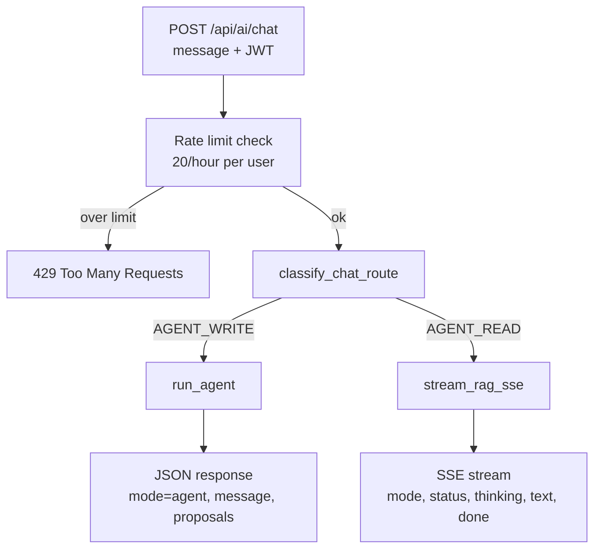

## Idea Vault — Version 5 Implementation Notes

---

## Backend Summary (Interview-Focused)

Version 5 added production-safe collection management and hardened idea image lifecycle behavior.

Most relevant backend themes:
- user-scoped authorization on every collection/image mutation
- ownership validation before writes
- safe handling of malformed legacy image data
- indexed query paths for common filters

---

## Collections: Flat Categorisation

### Why
Ideas needed a simple, user-friendly way to be grouped without introducing heavy hierarchy management.

Nested folders were intentionally avoided. Flat collections reduce query and mutation complexity while preserving practical grouping.

### Feature definition
A Collection is a named group an idea can belong to.
- One idea can belong to one collection or none (uncategorised).
- Collections are user-scoped.
- No nested collections.

### Data model
MongoDB collection: collections

Document shape:
- _id: ObjectId
- userId: string
- name: string
- emoji: string
- color: string (hex)
- createdAt: datetime
- updatedAt: datetime

Ideas were extended with:
- collectionId: Optional string (Mongo ObjectId as string), null for uncategorised

### Security model
All collection operations are authenticated and user-scoped.
- Every endpoint uses Depends(get_current_user).
- Every read/write query includes userId filtering.
- Collection IDs from URL/body are never trusted without ownership validation.

This prevents cross-user access even if someone guesses a valid ObjectId.

---

## Collections API: Full CRUD

### Canonical endpoints
- POST /api/collections
- GET /api/collections
- PUT /api/collections/{id}
- DELETE /api/collections/{id}

Additional read endpoint:
- GET /api/collections/get/{id}

### Behavior details
Create:
- Validates name, emoji, color.
- Enforces case-insensitive unique collection names per user.

List:
- Returns only current user's collections.
- Includes ideaCount per collection.

Update:
- Partial update supported (name/emoji/color optional).
- Name uniqueness check excludes current collection record.

Delete:
- Soft unlink is enforced.
- Ideas are never cascade-deleted when a collection is deleted.

Soft unlink flow:
1. Update matching ideas to collectionId = None
2. Delete the collection document

---

## Ideas API Integration: Collection Filtering

### What changed
GET ideas now supports optional collection filtering.

Route support:
- GET /api/ideas
- GET /api/ideas/list

New query parameter:
- collectionId

Filter rules:
- collectionId=<objectId> returns ideas in that collection
- collectionId=none returns uncategorised ideas only (collectionId is null)

Validation:
- Invalid ObjectId values for collectionId filter return 400

### Create and update idea integration
Idea create/update now validates collection assignment:
- collectionId must be a valid ObjectId string
- collection must belong to the current user
- invalid or foreign collectionId is rejected

Update supports explicit uncategorisation:
- collectionId null clears the assignment

---

## Ideas API Integration: Image Upload/Delete Hardening

### Endpoints
- POST /api/ideas/image
- DELETE /api/ideas/{idea_id}/image

### Security and correctness behavior
- Auth required and ownership enforced on delete (403 for non-owner).
- 404 for missing idea, 400 when no image is set.
- Cloudinary public_id extraction supports multiple URL shapes.
- Malformed/non-Cloudinary imageUrl values are handled safely:
	- database imageUrl is still cleared
	- request returns 204 (no user-visible failure)
	- structured warning/error is logged for audit/debug
- External CDN deletion is best-effort; DB state is the source of truth for UX consistency.

### Why this matters
This prevents brittle 500s from legacy/corrupt imageUrl data and keeps delete operations idempotent and production-safe.

---

## Agent Runtime Hardening (Production Bug Fix)

### Bug observed
`POST /api/agent` intermittently failed with a 500 when provider responses returned an empty or null `choices` payload.
{ The AI agent returned "Internal Server Error" because the question did not match any of the saved ideas. }

Representative failure:
- `TypeError: 'NoneType' object is not subscriptable`
- crash point: `response.choices[0]` in agent execution flow

### Root cause
The service assumed every successful completion call always contained at least one choice. Under transient provider/proxy edge cases, this assumption was invalid.

### Fix implemented
- Added defensive guards before indexing `response.choices` in both:
	- main agent completion turn
	- proposal-summary completion turn
- Added structured logging when no choices are returned.
- Added graceful fallback user message instead of raising unhandled exceptions.

### Why this matters
This converts a provider-side transient anomaly into a controlled degraded response, preserving API uptime and preventing user-facing 500s.

---

## Pydantic Schemas Added/Updated

### New file
- backend/app/schemas/collection.py
	- CollectionCreate
	- CollectionUpdate
	- CollectionResponse (with ideaCount)

### Updated file
- backend/app/schemas/idea.py
	- Added optional collectionId to IdeaCreate, IdeaUpdate, IdeaResponse, IdeaInDB
	- imageUrl remains optional and is used by image upload/delete flow

Validation highlights:
- Collection name trimmed, required, max length 50
- Color must be valid hex (example: #6366f1)

---

## Database and Indexing Updates

MongoDB connection bootstrap now creates:
- ideas index on userId
- ideas compound index on (userId, collectionId)
- collections index on userId

This keeps user-scoped lookups and collection-filtered idea queries fast and aligned with query patterns.

---

## Files Changed

- backend/app/api/collections.py
- backend/app/api/ideas.py
- backend/app/schemas/collection.py
- backend/app/schemas/idea.py
- backend/app/db/mongodb.py
- backend/app/services/image_service.py
- backend/app/services/agentic_ai/agent_service.py
- backend/app/main.py

---

## Validation and Current Status

### Completed checks
- Backend modules compile successfully after changes.
- Collections CRUD routes are wired into FastAPI.
- Soft unlink logic on delete is implemented.
- Ideas collectionId filtering is implemented.
- Image delete endpoint is resilient to malformed stored URLs and clears DB state reliably.
- Agent endpoint no longer crashes when LLM provider returns empty/null `choices`.

### Notes on Swagger verification
Implementation is complete and wired for the required flow.
Manual API acceptance checklist:
- create/list/update/delete collection
- assign and clear collectionId on idea update
- filter ideas by collectionId and by none
- upload image, delete image, verify imageUrl clears
- test delete image with malformed imageUrl value and confirm 204 + cleanup
- call `/api/agent` with normal prompts and verify graceful response even when upstream completion payload has empty/null choices

---

## Unified AI Chat Endpoint: One Door, Two Brains

> This section is written to be read start-to-finish by someone new to the codebase.
> It explains not just *what* was built, but *why* each decision was made and what
> alternatives were rejected. Take your time with it.

### The problem in plain English

Before this change, the app had **two separate AI features**, each with its own URL:

1. `POST /api/chat` — the **"read"** assistant. You ask a question about your ideas
   ("what are my fitness ideas?", "how many ideas do I have?") and it answers in
   plain text, streamed word-by-word like ChatGPT. Internally this is a **RAG**
   pipeline (explained below).
2. `POST /api/agent` — the **"write"** assistant. You ask it to *change* something
   ("improve my first idea", "add a task to my meal-prep idea") and it replies with
   **proposals** — suggested edits that you must approve before anything is saved.

The problem: **the frontend had to know in advance which one to call.** A user just
types a sentence into a chat box. They don't think "this is a read request" or "this
is a write request" — they just talk. Forcing the UI (or the user) to pick the right
endpoint is fragile and leaks backend structure into the frontend.

**The goal:** create a single endpoint, `POST /api/ai/chat`, that the frontend always
calls. The *backend* decides whether the message is a read or a write, and routes it
to the correct pipeline automatically.

### Background you need first (skip if you already know this)

**What is RAG?**
RAG = "Retrieval-Augmented Generation". Instead of letting the LLM answer from its
own memory (which knows nothing about *your* ideas), we first **retrieve** the user's
relevant ideas from the database, paste them into the prompt as context, and then ask
the LLM to **generate** an answer using that context. It's how the assistant can talk
about *your* private data without that data ever being part of the model's training.

**What is "the agent"?**
The agent is an LLM that has been given **tools** (functions it can call), like
`propose_idea_update` or `propose_task_creation`. When you ask it to change something,
it doesn't edit the database directly — it produces a **proposal** object describing
the change. A human approves or rejects it later. This "human-in-the-loop" design is a
safety feature: the AI can *suggest* writes, but never *performs* them on its own.

**What is SSE (Server-Sent Events)?**
A normal HTTP response sends the whole body at once. SSE keeps the connection open and
streams many small messages over time, each line starting with `data: `. We use it so
the read assistant can show its answer appearing token-by-token instead of making the
user stare at a spinner until the full answer is ready.

**What is "intent classification"?**
Asking a small, fast LLM to read a sentence and output a single label describing what
the user *wants* (e.g. `COUNT`, `LISTING`). It's a cheap way to make routing decisions.

### The core idea: classify first, then route

The new endpoint does three things in order:

1. **Rate-limit** the user (reject abusive volumes before spending any money on LLM calls).
2. **Classify** the message into one of two buckets: `AGENT_WRITE` or `AGENT_READ`.
3. **Route**:
   - `AGENT_WRITE` → run the agent → return **JSON** with proposals.
   - `AGENT_READ` → run the RAG pipeline → return an **SSE stream** of text.



### Decision 1 — A separate "routing brain", NOT an extension of the existing one

The existing read pipeline already has an intent classifier with an enum called
`QueryIntent` (`CONVERSATIONAL`, `LISTING`, `SEMANTIC_SEARCH`, `COUNT`). The obvious
shortcut would be: "just add two more values, `AGENT_WRITE` and `AGENT_READ`, to that
same enum."

**We deliberately did NOT do that.** Here's why:

`QueryIntent` is consumed by other functions deep inside the RAG pipeline —
`route_query` (decides which database lookup to run) and `select_tier_for_intent`
(decides which LLM model size to use). Those functions have a hard assumption: *every*
`QueryIntent` value is a kind of read. If we added `AGENT_WRITE` to that enum, every
one of those functions would suddenly receive a value it has no idea how to handle. We'd
have to hunt down and patch each one, and we'd risk subtle bugs where a write intent
accidentally flows into read-only retrieval code.

So instead we created a **brand-new, separate enum** called `ChatRoute` with exactly two
values (`AGENT_WRITE`, `AGENT_READ`) and a separate function `classify_chat_route()`.
This is a coarser, higher-level decision that sits *above* the existing one:

- `classify_chat_route()` decides **which pipeline** (agent vs RAG).
- The old `classify_intent()` still runs *inside* the RAG pipeline to decide **how to
  read** (count vs list vs search).

This is a general principle worth remembering: **when a new concept doesn't fit the
assumptions of an existing type, make a new type rather than overloading the old one.**
Overloading saves three lines today and costs you a week of debugging later.

### Decision 2 — Regex fast-path first, LLM second (a hybrid classifier)

How does `classify_chat_route()` actually decide write vs read? There were three options:

- **Option A: pure keyword/regex matching.** Fast and free, but brittle. The sentence
  "I have ideas about *improving* my sleep" contains the word "improve" but is clearly a
  *read*, not a command to edit anything. Pure keywords produce false positives.
- **Option B: pure LLM classification.** Accurate, but every single message — including
  trivial ones like "improve my first idea" — costs an LLM call and adds latency.
- **Option C (chosen): a hybrid.** First run a *very conservative* regex that only
  matches obvious, unambiguous write commands. If it matches, we're done instantly — no
  LLM call. If it doesn't match, fall back to a small/fast LLM that makes the final call.

The regex (`_WRITE_FASTPATH`) is intentionally **high-precision, low-recall**: it would
rather miss a real write (and let the LLM catch it) than wrongly flag a read. That's why
it requires the action verb to sit *next to* a reference to the user's content. For
example it matches "improve **my idea**" or "rewrite **the description**", but it will
**not** match "ideas about improving sleep", because "improve" there isn't followed by
words like *idea / task / description / it / my*.

Anything the regex isn't sure about goes to the LLM, which is given a focused prompt with
worked examples and must answer with just `AGENT_WRITE` or `AGENT_READ`.

**The safety net:** if the LLM is rate-limited, returns nothing, or returns garbage, we
default to `AGENT_READ`. Why read and not write? Because the read path is non-destructive
— the worst case is the user gets an answer instead of a proposal, which is mildly
annoying. Defaulting to *write* could surface confusing, unwanted edit suggestions.
**When in doubt, pick the safer behavior.**

### Decision 3 — Two different response *shapes*, on purpose

This endpoint is unusual: it can return **two completely different types of HTTP response**
depending on the route.

- **Write** → a normal JSON object:
  `{"mode": "agent", "message": "...", "proposals": [ ... ]}`
- **Read** → an SSE stream (`Content-Type: text/event-stream`).

Why not force both into the same shape? Because they have genuinely different needs. A set
of proposals is a *finished, structured object* — the UI needs all of it at once to render
review cards with Accept/Reject buttons. A conversational answer is *a flow of text* that
feels best when streamed live. Forcing proposals into a stream, or buffering the chat answer
into one big JSON blob, would make both worse.

So the frontend tells the two apart by looking at the response's `Content-Type` header:
`application/json` means "agent proposals", `text/event-stream` means "live chat".

To make the streaming case even easier for the client, the **very first SSE event** we send
is `{"type": "mode", "content": "rag"}`. This way the frontend instantly knows "this is a
read stream" without waiting or guessing.

One small but important detail: proposals contain enum values (like idea status/priority).
Python's default JSON serializer can't handle enums, so we serialize with
`model_dump(mode="json")`, which converts enums into plain strings. (This is the kind of bug
that only shows up at runtime, so it's worth knowing.)

### Decision 4 — Share code, don't copy-paste

Both the old `/api/chat` and the new `/api/ai/chat` need the *exact same* read behavior
(rate limiting + the RAG streaming logic). Copy-pasting that logic into two files would mean
every future bug fix has to be made twice — and someone will eventually forget. So we pulled
the shared pieces into their own small modules:

- `app/core/rate_limit.py` → `check_message_rate_limit()`. Both endpoints call this. Because
  they share the **same Redis key** (`chat_rl:{user_id}`), a user can't dodge the limit by
  hopping between endpoints — all their AI usage counts against one budget.
- `app/ai/chat_pipeline.py` → `stream_rag_sse()` and `format_sse()`. This is now the single
  source of truth for "decompose the question → fetch the user's ideas → stream the answer as
  SSE". The old `/api/chat` was refactored to call this instead of holding its own copy.

This is the **DRY principle** ("Don't Repeat Yourself"): one behavior should live in exactly
one place.

### Decision 5 — Keep the old endpoints, but mark them deprecated

We did **not** delete `/api/chat` and `/api/agent`. Anything still calling them (the current
frontend, saved bookmarks, tests) would break instantly if we removed them. Instead we marked
them with `deprecated=True`, which:

- keeps them fully working, and
- visibly flags them as "old" in the auto-generated API docs (Swagger),

so we can migrate the frontend calmly and delete them in a later cleanup pass. This is the
standard, professional way to retire an API: **deprecate first, remove later.** Note that
`/api/agent/decide` (the Accept/Reject approval step) is **not** deprecated — the unified
endpoint only replaces the *propose* and *ask* steps, not the approval step.

### Security guarantees (these were preserved, not invented)

The new endpoint follows the same rules every protected route in this app follows:

- **`user_id` always comes from the verified JWT, never from the request body.** A user
  physically cannot ask about or edit someone else's ideas, because the identity is taken from
  their signed token, not from anything they typed.
- **Input is length-capped** at the HTTP boundary (`ChatRequest`, max 500 chars) and *again*
  inside the classifier (truncated to 200 chars). This is "defence in depth" — limiting the
  blast radius of any prompt-injection attempt.
- **Rate limiting runs before any LLM call**, so abusive traffic is rejected for free.

### The request/response contract (what the frontend must handle)

Request (identical for both routes):
```
POST /api/ai/chat
Authorization: Bearer <jwt>
Body: { "message": "..." }   // 1–500 characters
```

Response — write route:
```
Content-Type: application/json
{ "mode": "agent", "message": "Here are my suggestions", "proposals": [ {...}, {...} ] }
```

Response — read route:
```
Content-Type: text/event-stream
data: {"type": "mode",     "content": "rag"}
data: {"type": "status",   "content": "Searching your ideas..."}
data: {"type": "thinking", "content": "..."}
data: {"type": "text",     "content": "Your"}
data: {"type": "text",     "content": " ideas"}
data: {"type": "done",     "content": ""}
```

### Files changed

New files:
- `backend/app/api/ai.py` — the unified `POST /api/ai/chat` endpoint.
- `backend/app/ai/chat_pipeline.py` — shared RAG-to-SSE streaming helper (`stream_rag_sse`, `format_sse`).
- `backend/app/core/rate_limit.py` — shared per-user rate limiter (`check_message_rate_limit`).

Updated files:
- `backend/app/services/intent_classifier.py` — added `ChatRoute` enum, `_WRITE_FASTPATH` regex, and `classify_chat_route()`.
- `backend/app/api/chat.py` — refactored to use the shared helpers; marked `deprecated=True`.
- `backend/app/api/agent.py` — propose endpoint marked `deprecated=True` (approval endpoint untouched).
- `backend/app/main.py` — registered the new `ai` router under `/api`.

### How to verify it works

1. Send `POST /api/ai/chat` with `{"message": "what are my ideas?"}` →
   expect `Content-Type: text/event-stream`, a leading `mode: rag` event, then streamed text.
2. Send `POST /api/ai/chat` with `{"message": "improve my first idea"}` →
   expect `Content-Type: application/json` with `"mode": "agent"` and a `proposals` array.
3. Send 21 messages within an hour → the 21st should return `429`.
4. Confirm the old `/api/chat` and `/api/agent` still respond but appear struck-through /
   marked deprecated in Swagger.

